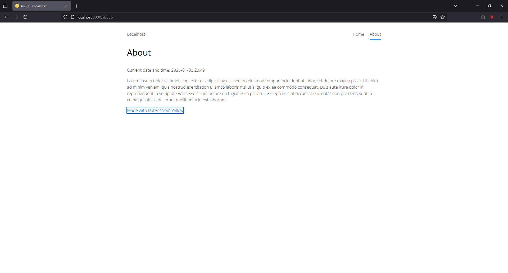

<p align="right"><a href="README-de.md">Deutsch</a> &nbsp; <a href="README.md">English</a></p>

# Datetime 0.9.0

Show date and time in your pages.

<p align="center"></p>

## How to install an extension

[Download ZIP file](https://github.com/schulle4u/yellow-datetime/archive/refs/heads/main.zip) and copy it into your `system/extensions` folder. [Learn more about extensions](https://github.com/annaesvensson/yellow-update).

## How to show date and time information

Create a `[datetime]` shortcut. The following optional argument is available: 

`Format` = date and time format  

This inline shortcut can be used to display date and time information in your pages.  You may use it to welcome your visitors in a different way, or just to automatically keep the year in your copyright notice updated. Use the [date and time formats](https://www.php.net/manual/en/datetime.formats.php) supported by PHP to customize the output.

## Examples

Basic usage: 

    Current date and time: [datetime]

Different format:

    Date: [datetime Y-m-d]

Shared footer page with copyright notice: 

```
---
Title: Footer
Status: shared
--- 
Copyright &copy; 2013-[datetime Y] Datenstrom
```

## Developer

Steffen Schultz. [Get help](https://datenstrom.se/yellow/help/).
